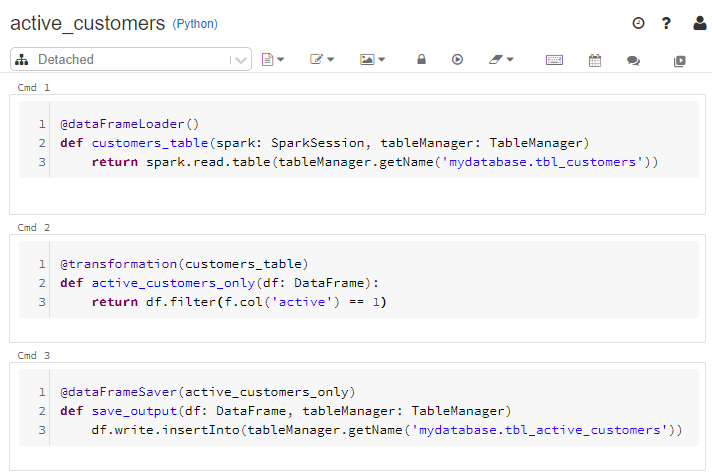

## Writing function-based notebooks

Compared to bare notebooks, the function-based approach brings the **following advantages**: 

1. create and publish auto-generated documentation and lineage of notebooks and pipelines (Bricksflow PRO) 
1. write much cleaner notebooks with properly named code blocks
1. (unit)test specific notebook functions with ease
1. use YAML to configure your notebooks for given environment (dev/test/prod/...)
1. utilize pre-configured objects to automate repetitive tasks

Function-based notebooks have been designed to provide the same user-experience as bare notebooks.
Just write the function, annotate it with `@[decorator]` (details bellow) and run the cell.

### Datalake-related decorators

Besides the standard `@notebookFunction` decorator [defined by the databricks-bundle](https://github.com/bricksflow/databricks-bundle/blob/master/docs/notebook-functions.md),
the datalake-bundle provides you with **3 new types of decorators**:
 
`@dataFrameLoader` - loads some Spark dataframe (from Hive table, csv, ...) and returns it

* Support for displaying results by setting the `display=True` decorator argument.

`@transformation` - transforms given dataframe(s) (filter, JOINing, grouping, ...) and returns the result

* Support for displaying results by setting the `display=True` decorator argument.
* Duplicate output columns checking enabled by default

`@dataFrameSaver` - saves given dataframe into some permanent storage (parquet, Delta, csv, ...)

### Chaining notebook-functions

Calls of the notebook functions can be chained by passing function names as decorator arguments:

Once you run the `active_customers_only` function's cell, it gets is automatically called with the dataframe loaded by the `customers_table` function.

Similarly, once you run the `save_output` function's cell, it gets automatically called with the filtered dataframe returned from the `active_customers_only` function.

___

Next section: [Using table-specific configuration](configuration.md)
